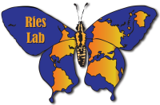

Ries Lab of Butterfly Informatics
================

We study large-scale patterns of insects, mostly butterflies, using a
combination of laboratory and data-intensive approaches. Our laboratory
work on thermal tolerances is designed to provide key parameters for
large-scale distribution and phenology models that we then test with
independent distribution data, mostly acquired from citizen science
monitoring programs. We also support and curate a variety of databases
that provide information on ecological traits and distribution which are
a resource for the public. Finally, we lead efforts to support a network
of butterfly monitoring programs throughout North America, especially
geared towards data management, curation and sharing.

This site is under development. Also check out our [main
website](butterflyinformatics.org).

